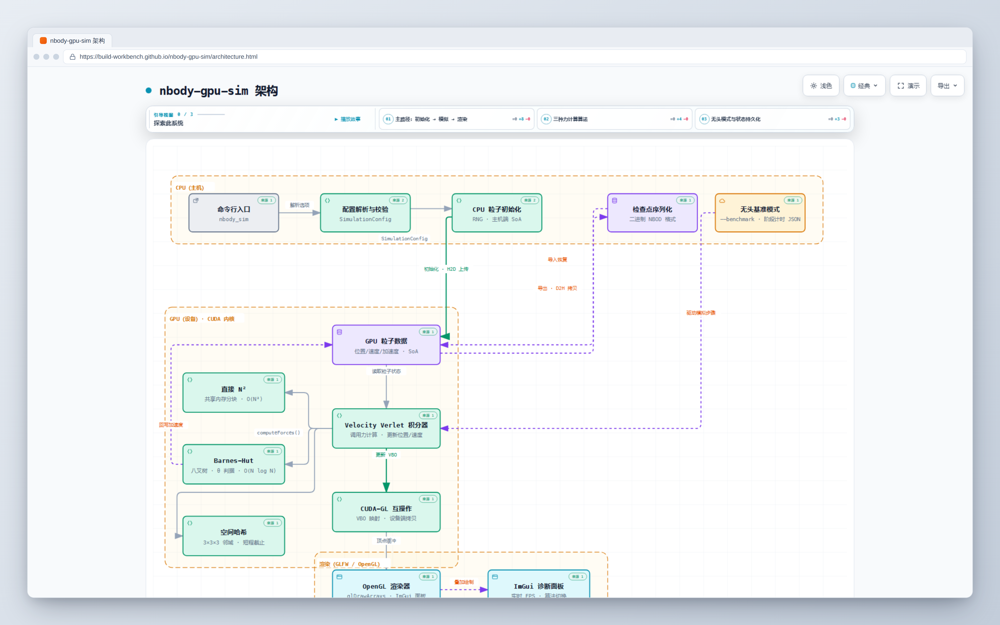

# nbody-gpu-sim

CUDA-accelerated N-body gravitational simulation, supporting three force algorithms and real-time OpenGL visualization.

[](https://github.com/build-workbench/nbody-gpu-sim/actions/workflows/ci.yml)
[](LICENSE)
[](CMakeLists.txt)
[](CMakeLists.txt)

<div align="center">
  
  <p><em>nbody-gpu-sim architecture UI · three force algorithms and the CUDA/OpenGL pipeline</em></p>
</div>

## Quick Start

```bash
git clone https://github.com/build-workbench/nbody-gpu-sim.git
cd nbody-gpu-sim
./scripts/build.sh
./build/nbody_sim 100000        # 10 万粒子
```

Dependencies: NVIDIA GPU (CUDA 11.8+), CMake 3.18+, OpenGL 3.3+ (GLFW/GLEW/GLM).

Run tests: `./scripts/test.sh`  ·  JSON performance benchmark: `./scripts/benchmark.sh`

## Features

- **Three force algorithms**, switchable at runtime via `1`/`2`/`3`: Direct N² (exact reference), Barnes-Hut (O(N log N)), Spatial Hash (short-range O(N))
- Velocity Verlet symplectic integration for long-term energy stability
- CUDA-OpenGL interoperability with zero-copy GPU memory rendering
- Non-interactive benchmark and checkpoint import/export

## Controls

| Key | Function |
|------|------|
| `Space` | Pause / Resume |
| `R` | Reset |
| `1` / `2` / `3` | Switch force algorithm |
| `C` | Reset camera |
| Mouse drag / scroll wheel | Rotate / Zoom |
| `Esc` | Exit |

## Configuration

`nbody_sim --particles N --method barnes-hut --benchmark --benchmark-output result.json` — see `--help` for the full set of options.

## Documentation

- Online documentation (demo site): <https://build-workbench.github.io/nbody-gpu-sim/>
- Detailed guide: [`docs/`](docs/)  ·  Examples: [`examples/`](examples/)

## License

[MIT](LICENSE) © Vibe Knight

---

<a id="chinese"></a>

# nbody-gpu-sim

CUDA 加速的 N 体引力模拟,支持三种力算法与 OpenGL 实时可视化。

[](https://github.com/build-workbench/nbody-gpu-sim/actions/workflows/ci.yml)
[](LICENSE)
[](CMakeLists.txt)
[](CMakeLists.txt)

<div align="center">
  
  <p><em>nbody-gpu-sim 架构界面 · 三种力算法与 CUDA/OpenGL 流水线</em></p>
</div>

## 快速开始

```bash
git clone https://github.com/build-workbench/nbody-gpu-sim.git
cd nbody-gpu-sim
./scripts/build.sh
./build/nbody_sim 100000        # 10 万粒子
```

依赖:NVIDIA GPU(CUDA 11.8+)、CMake 3.18+、OpenGL 3.3+(GLFW/GLEW/GLM)。

运行测试:`./scripts/test.sh`  ·  JSON 性能基准:`./scripts/benchmark.sh`

## 特性

- **三种力算法**,运行时 `1`/`2`/`3` 切换:Direct N²(精确参考)、Barnes-Hut(O(N log N))、Spatial Hash(短程 O(N))
- Velocity Verlet 辛积分,长期能量稳定
- CUDA-OpenGL 互操作,GPU 内存零拷贝渲染
- 非交互 benchmark 与 checkpoint 导入/导出

## 操作

| 按键 | 功能 |
|------|------|
| `Space` | 暂停 / 恢复 |
| `R` | 重置 |
| `1` / `2` / `3` | 切换力算法 |
| `C` | 重置相机 |
| 鼠标拖拽 / 滚轮 | 旋转 / 缩放 |
| `Esc` | 退出 |

## 配置

`nbody_sim --particles N --method barnes-hut --benchmark --benchmark-output result.json` — 完整参数见 `--help`。

## 文档

- 在线文档(演示站点):<https://build-workbench.github.io/nbody-gpu-sim/>
- 详细指南: [`docs/`](docs/)  ·  示例: [`examples/`](examples/)

## License

[MIT](LICENSE) © Vibe Knight
